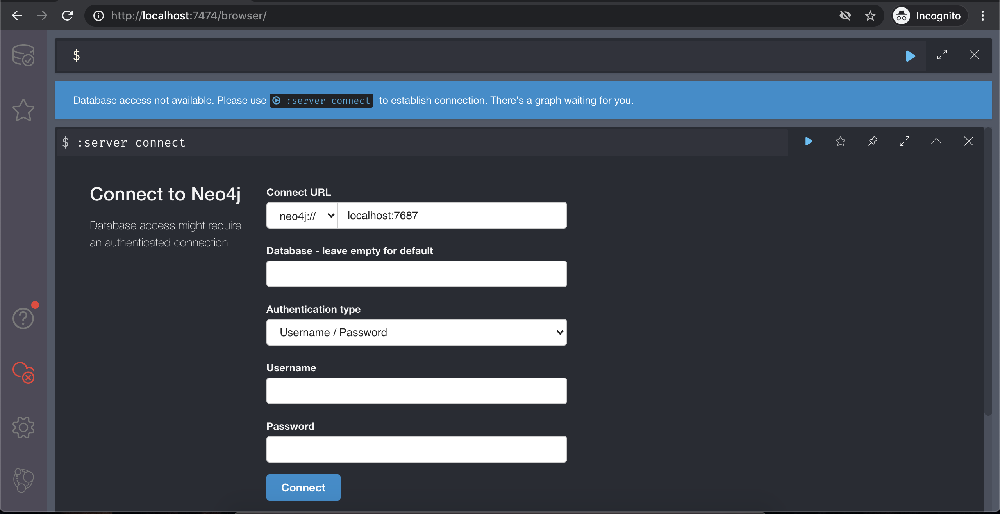
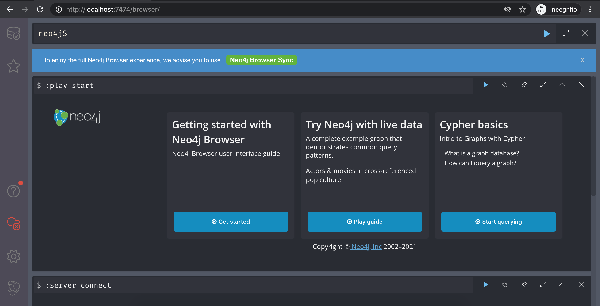
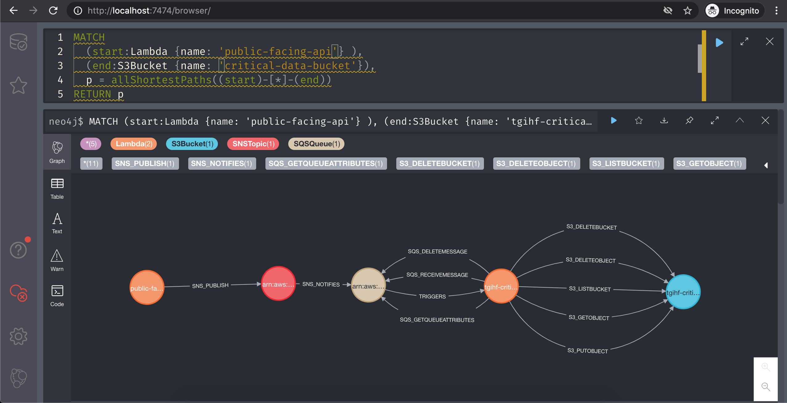

# aws-resource-mapper

`aws-resource-mapper` enumerates your AWS resources and their relationships and ingests that information into a `Neo4j` database for you to explore.

## Installation

Clone the repository and install the dependencies.

```bash
git clone https://github.com/tgihf/aws-resource-mapper.git
cd aws-resource-mapper
virtualenv -p python3 venv
source venv/bin/activate
pip install -r requirements.txt
```

## Usage

```text
usage: aws_resource_mapper.py [-h] [--url url] [--user user]

Map AWS resources in a Neo4j Graph Database

optional arguments:
  -h, --help   show this help message and exit
  --url url    URL of Neo4j Database to map AWS resources in
  --user user  Neo4j user to map AWS resources as
```

`url` defaults to `bolt://localhost:7687`.

`user` deaults to `neo4j`.

You'll be prompted for the `Neo4j` password.

`aws-resource-mapper` leverages `boto3` to interact with AWS and as a result leverages `boto3`'s [credential functionality](https://boto3.amazonaws.com/v1/documentation/api/latest/guide/credentials.html) for AWS authentication.

## Example

### Run the script and enter in your `Neo4j` credentials to collect your AWS resource data and ingest it into Neo4j

```bash
(venv) $ python3 aws_resource_mapper.py --url bolt://localhost:7687 --user neo4j
[*] Password of Neo4j user neo4j to map AWS resources as: [ENTER NEO4J PASSWORD]
[*] Attempting to authenticate to Neo4j...
[*] Authentication to Neo4j successful!
[*] Attempting to gather resource information from AWS using boto3 credentials...
[*] AWS resource collection complete
[*] Attempting to ingest AWS resources into Neo4j...
[*] Neo4j ingestion complete!
```

### Navigate to Neo4j browser and login with your Neo4j credentials





### Query Away!



## Required AWS Permissions

The following AWS permissions are required for proper collection. Ensure the credentials you use for `boto3` map to a role with these permissions.

```text
# DynamoDB
DynamoDB:ListTables

# Glue
Glue:GetDatabases
Glue:GetTables

# IAM
IAM:ListAttachedRolePolicies
IAM:ListRoles
IAM:ListRolePolicies
IAM:GetPolicy
IAM:GetPolicyVersion
IAM:GetRolePolicy

# KMS
KMS:ListKeys

# Lambda
Lambda:ListFunctions
Lambda:ListEventSourceMappings

# S3
S3:ListBuckets
S3:GetBucketPolicy

# SNS
SNS:ListTopics
SNS:ListSubscriptions

# SQS
SQS:ListQueues
SQS:GetQueueAttributes

# STS
STS:GetCallerIdentity
```

## Useful Cypher Queries

The following Cypher queries may be helpful in finding useful relationships among your AWS resources once they've been ingested into your `Neo4j` database. They can be used in the web interface of your `Neo4j` server.

### Find the Shortest Path Between Two Resources

```cypher
MATCH
  (start:Lambda {name: 'public-facing-api'}),
  (end:S3Bucket {name: 'critical-data-bucket'}),
  p = shortestPath((start)-[*..15]-(end))
RETURN p
```

* Maximum relationship length is 15 in this example, can be changed

### Find All Shortest Paths Between Two Resources

```cypher
MATCH
  (start:Lambda {name: 'auth-api'} ),
  (end:DynamoDB {name: 'critical-data-db'}),
  p = allShortestPaths((start)-[*]-(end))
RETURN p
```
